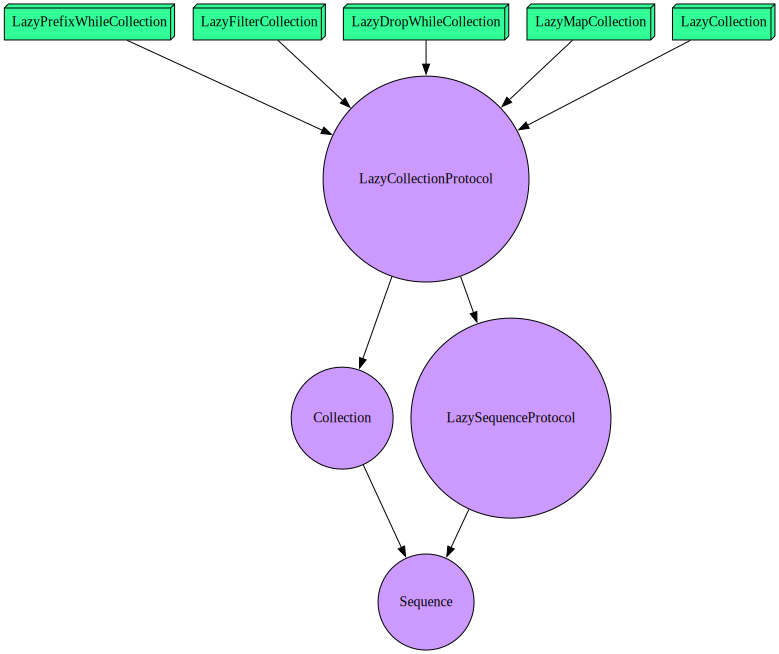

# swift-grapher

A small utility that attempts to visually map the relationships between protocols (purple circles) to protocols that inherit them and the types that conform to them (boxes for direct conformance and 3D boxes for conformance via an extension). Arrows indicate conformance or inheritance.

Currently the color scheme is:

- Type:
  - Green - public type
  - Red - private type
  - Shapes:
    - Box - direct conformance (i.e. `struct X: Y`)
    - Box3D - conformance via extension (i.e. `extension X: Y`)
- Protocol:
  - Light Purple - public protocol
  - Dark Purple - private protocol
  - Shapes:
    - Circle
